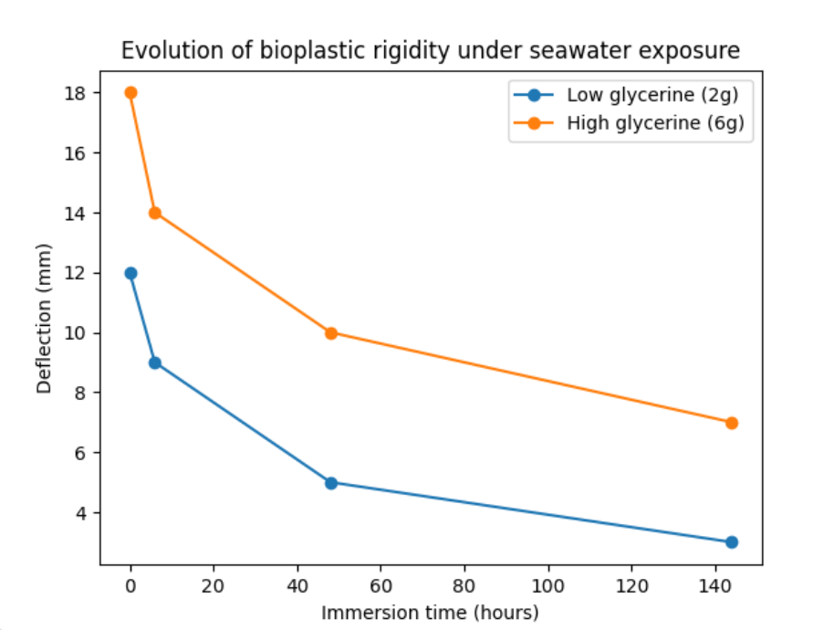

# OCEAN IMPRINTS

**Bioplastic films × Saltwater interaction**

---

## Project Description

OCEAN IMPRINTS explores how alginate-based bioplastics behave in a marine-like environment.  
While bioplastics are often presented as sustainable alternatives, their behavior in real conditions remains poorly understood.

This project investigates the gap between **promise and reality**, focusing on:

- Material transformation rather than disappearance  
- The influence of environmental conditions  
- The role of context in material sustainability  

The outcome is a **design space and material atlas** documenting transformations such as deformation, crystallization, and rigidification.

---

## Key Insight

> Bioplastics do not disappear in marine environments — they transform.

---

## Research Question

**What happens to bioplastics when exposed to a real environment such as the ocean?**

---

## Approach

The project is structured as an experimental design space based on variables:

- **Recipe** (glycerine concentration → flexibility)  
- **Water** (with or without seawater)  
- **Method** (immersion vs vaporization)  
- **Exposure intensity**  
  - Immersion: 6h / 2 days / 6 days  
  - Vaporization: 1 spray / 3 sprays  
- **Light** (with or without)  

---

## Results

- No disappearance observed  
- Progressive rigidification  
- Structural deformation  
- Salt crystallization  
- Persistence of material  

These results challenge the assumption that bioplastics are inherently harmless in natural environments.

---

## Results — Rigidity Evolution

**Figure — Evolution of bioplastic rigidity under seawater exposure**

- X-axis: immersion time (hours)  
- Y-axis: deflection (mm)  
- Lower values = higher rigidity  

→ Rigidification increases over time  
→ High glycerine maintains flexibility longer  

---

## How to Replicate

### Materials

- Sodium alginate  
- Glycerine  
- Distilled water  
- Calcium lactate  
- Sea salts (NaCl, MgSO₄, Ca²⁺ source)  

---

### Steps

1. Prepare bioplastic films (`materials/recipes/alginate_recipe.md`)  
2. Cast and dry (24–48h)  
3. Prepare artificial seawater (`materials/recipes/seawater_recipe.md`)  
4. Expose samples: (`results/data_tables.csv`)
